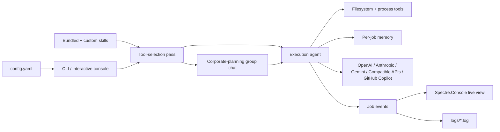

# OneShotPrompt

OneShotPrompt is a .NET 10 console application for running one-shot AI jobs from YAML.

It is built for local automation that should stay simple, explicit, and reviewable: define jobs in a single config file, let the runtime narrow the tool set before execution, stream what the agent is doing, and keep scheduling in the operating system instead of burying it inside the app.

## Why OneShotPrompt

Most AI automation tools either hide too much behavior or ask you to build a full platform before you can automate anything useful. OneShotPrompt takes a smaller approach:

- Define repeatable jobs in `config.yaml`.
- Run all jobs or a single named job on demand.
- Choose from OpenAI, Anthropic, Gemini, OpenAI-compatible endpoints, or GitHub Copilot.
- Keep file and process access behind an explicit safety switch.
- Persist lightweight job memory only when you want it.
- Use Windows Task Scheduler, cron, or another scheduler you already trust.

## What It Can Do

- Load jobs from YAML and validate configuration before execution.
- Run bundled and user-provided Agent Skills.
- Perform a tool-selection pass before the execution agent runs.
- Run an optional dynamic `corporate-planning` group chat before returning the final response.
- Stream agent activity live in interactive terminals with Spectre.Console.
- Write structured execution logs to a `logs/` directory next to the active config file.
- Store per-job memory in `.oneshotprompt/memory/` when memory is enabled.
- Support both named jobs and ad-hoc prompts from the interactive menu.
- Publish as Native AOT by default.

## How It Works



## Supported Providers

- OpenAI
- Anthropic
- Gemini
- OpenAI-compatible endpoints
- GitHub Copilot via the GitHub Copilot CLI

Gemini jobs run through `GeminiDotnet.Extensions.AI`, which keeps them on the same Microsoft Agent Framework execution path as the other chat-client-backed providers while remaining Native AOT friendly.

GitHub Copilot jobs require the GitHub Copilot CLI to be installed and authenticated. OneShotPrompt keeps Copilot CLI shell, file, and URL permissions disabled and continues to route local actions through the selected built-in OneShotPrompt tools.

## Quick Start

### Prerequisites

- The .NET SDK version pinned in `global.json`
- A provider API key or authenticated GitHub Copilot CLI session
- A `config.yaml` file based on `config.example.yaml`

### 1. Create a config file

Copy `config.example.yaml` to `config.yaml`, then fill in only the provider settings you plan to use.

Minimal example:

```yaml
OpenAI:
  ApiKey: ""
  Model: "gpt-5-nano"

ThinkingLevel: "low"
PersistMemory: true

Jobs:
  - Name: "downloads-cleanup"
    Prompt: "Organize files in Downloads by type"
    Provider: "OpenAI"
    Workflow: "single-agent"
    AutoApprove: true
    AllowedTools: "GetKnownFolder, ListDirectory, MoveFiles, CreateDirectory"
    Enabled: true
```

### 2. Validate the config

```powershell
dotnet run --project src/OneShotPrompt.Console -- validate --config config.yaml
```

### 3. List the jobs

```powershell
dotnet run --project src/OneShotPrompt.Console -- jobs --config config.yaml
```

### 4. Run everything or one job

```powershell
dotnet run --project src/OneShotPrompt.Console -- run --config config.yaml
dotnet run --project src/OneShotPrompt.Console -- run --config config.yaml --job downloads-cleanup
```

### 5. Open the interactive console

```powershell
dotnet run --project src/OneShotPrompt.Console -- interactive
```

If you launch the app with no arguments from an interactive terminal, OneShotPrompt opens the menu automatically. If output is redirected, a no-argument invocation falls back to `run --config config.yaml`.

## Interactive Mode

The interactive console is intended for local operation, inspection, and ad-hoc prompting.

```text
────────────── OneShotPrompt ──────────────
Config file: config.yaml
Select action:
> Run direct prompt
  Run all jobs
  Run specific job
  Validate
  List jobs
  Clear memories
```

`Run direct prompt` lets you choose a provider, decide whether mutation tools are allowed, and execute an ad-hoc task using the same provider settings as your named jobs.

During execution, interactive terminals show live agent activity, including reasoning updates, tool calls, and tool results.

## Safety Model

The main safety boundary is `AutoApprove`.

- `AutoApprove: false` exposes inspection-only tools.
- `AutoApprove: true` enables file mutation tools and built-in process execution tools.

`AllowedTools` is an additional restriction layer. When present, it filters the tool catalog before the selector runs. This keeps jobs narrower and more deterministic.

Current built-in tools include:

- Inspection: `GetKnownFolder`, `ListDirectory`, `ReadTextFile`, `ReadTextFileLines`, `GetTextFileLength`
- File mutation: `CreateDirectory`, `MoveFile`, `MoveFiles`, `CopyFile`, `DeleteFile`, `WriteTextFile`
- Process execution: `RunCommand`, `RunDotNetCommand`

Use read-only jobs for inspection, analysis, and planning. Only enable mutation when the job is deterministic enough that you are comfortable granting write access.

Jobs can also opt into `Workflow: "corporate-planning"`. In that mode, OneShotPrompt keeps the same provider and tool-selection pass, then generates a temporary team of specialist agents on the fly, assigns each agent a subset of the selected tools, and runs them in a Microsoft Agent Framework group chat until one agent emits the final response payload.

## Agent Skills

OneShotPrompt automatically loads Agent Skills from two places:

- Bundled skills shipped with the console app
- A `skills/` directory next to the active config file

Before the main execution agent is created, the runtime runs a selector pass that chooses the smallest relevant tool subset for the job. The execution agent then runs with that selected subset.

If a job uses `Workflow: "corporate-planning"`, the selected subset is redistributed across dynamically generated planning agents rather than attached to one execution agent.

## Logging And Memory

- `run` commands write timestamped logs to `logs/` next to the active config file.
- Interactive direct prompts also write logs there.
- Logs include thinking events, tool calls, arguments, tool results, response chunks, and job lifecycle events.
- When memory is enabled, OneShotPrompt stores a small rolling history per job in `.oneshotprompt/memory/` next to the active config file.

## Common Workflows

Use OneShotPrompt when you want:

- A scheduled file-management or cleanup task backed by an LLM
- A repeatable repository audit or build-check job
- A local AI task runner with explicit tool access boundaries
- A single binary-friendly console app that can be published with Native AOT

It is a weaker fit when you need:

- Long-running autonomous agents
- Multi-user orchestration or a hosted control plane
- Hidden background automation without explicit operating-system scheduling

## Documentation

- [Use cases](docs/use-cases.md)
- [Configuration guide](docs/configuration.md)
- [CLI reference](docs/cli-reference.md)
- [Operations guide](docs/operations.md)
- [Windows Task Scheduler walkthrough](docs/windows-task-scheduler.md)
- [Linux scheduling walkthrough](docs/linux-scheduling.md)

## Project Layout

- `src/OneShotPrompt.Core`: domain models and configuration types
- `src/OneShotPrompt.Application`: use cases and orchestration
- `src/OneShotPrompt.Infrastructure`: YAML loading, provider integration, built-in tools, and memory persistence
- `src/OneShotPrompt.Console`: CLI entrypoint, interactive console, and bundled Agent Skills
- `tests/OneShotPrompt.Tests`: xUnit coverage for configuration, orchestration, and integration behavior

## Build And Test

```powershell
dotnet restore OneShotPrompt.slnx
dotnet build OneShotPrompt.slnx
dotnet test tests/OneShotPrompt.Tests/OneShotPrompt.Tests.csproj
```

## Notes

- `ThinkingLevel` accepts `low`, `medium`, or `high`.
- `Workflow` accepts `single-agent` or `corporate-planning`.
- Custom skills can be placed in a `skills/` directory next to the active config file.
- `MoveFiles` moves multiple files concurrently and is usually preferable to repeated `MoveFile` calls.
- Configuration validation rejects unsupported YAML sections or properties.
- `config.example.yaml` is the safe source of example configuration.

## License

This project is licensed under the MIT License. See [LICENSE](LICENSE).
