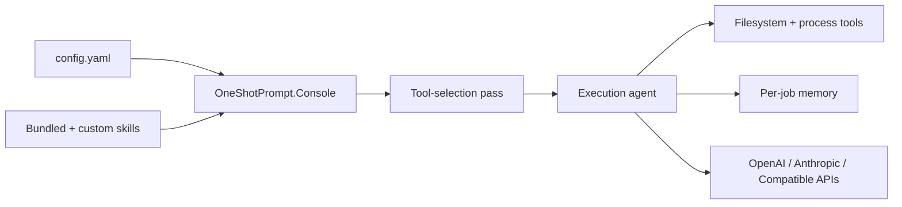

# OneShotPrompt

OneShotPrompt is a .NET 10 console application for running one-shot AI jobs from YAML configuration.

It uses Microsoft Agent Framework for agent execution, supports OpenAI, Anthropic, and OpenAI-compatible endpoints, persists lightweight job memory when enabled, and is configured for Native AOT publishing by default.

## What It Does

- Loads jobs from `config.yaml`.
- Runs all enabled jobs or a single named job.
- Loads bundled and user-provided Agent Skills.
- Runs an automatic tool-selection pass before execution.
- Persists per-job memory in `.oneshotprompt/memory/` when enabled.
- Leaves scheduling to the operating system.

## How It Fits Together



## Quick Start

1. Copy `config.yaml.example` to `config.yaml`.
2. Fill in the provider settings you need and add at least one job.
3. Validate the config.
4. List jobs or run one.

```powershell
dotnet run --project src/OneShotPrompt.Console -- validate --config config.yaml
dotnet run --project src/OneShotPrompt.Console -- jobs --config config.yaml
dotnet run --project src/OneShotPrompt.Console -- run --config config.yaml
dotnet run --project src/OneShotPrompt.Console -- run --config config.yaml --job downloads-cleanup
```

If you run the app with no arguments, it defaults to `run --config config.yaml`.

## Docs

- [Configuration guide](docs/configuration.md)
- [Operations guide](docs/operations.md)
- [Windows Task Scheduler walkthrough](docs/windows-task-scheduler.md)
- [Linux scheduling walkthrough](docs/linux-scheduling.md)

## Project Layout

- `src/OneShotPrompt.Core`: domain models and configuration types.
- `src/OneShotPrompt.Application`: use cases and orchestration.
- `src/OneShotPrompt.Infrastructure`: YAML loading, provider integration, low-level built-in tools, and memory persistence.
- `src/OneShotPrompt.Console`: CLI entrypoint with Native AOT enabled and bundled Agent Skills.

## Notes

- `ThinkingLevel` accepts `low`, `medium`, or `high`.
- `AutoApprove: false` exposes read-only tools only.
- `AutoApprove: true` enables file-changing tools and process execution tools.
- `AllowedTools` can further restrict the tool catalog before selection.
- Custom skills can be placed in a `skills/` directory next to the active config file.
- Job memory is stored in `.oneshotprompt/memory/` next to the active config file.

## Build

```powershell
dotnet build OneShotPrompt.slnx
```

## Development Conventions

- NuGet package versions are managed centrally in `Directory.Packages.props`.
- Repo-wide C# formatting and code style preferences live in `.editorconfig`.
